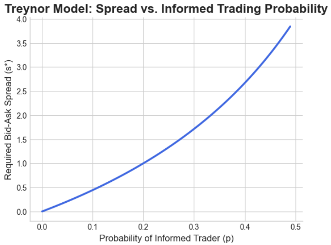

# A Replication of the Treynor (1971) Dealer Model

This repository contains the Python code and research for our upcoming papers on **orderbook dynamics and dealer behaviour** in current highly evolved markets.

## Abstract

This project presents a computational replication of the foundational 1971 Treynor dealer model. We implement the core mathematical relationship between a market maker's bid-ask spread and the probability of trading with an informed party. The model demonstrates that adverse selection is a quantifiable cost that market makers must offset by widening their spread, effectively creating a "liquidity tax" paid by uninformed market participants.

## Key Result

The primary result of the model shows that the required bid-ask spread a market maker must charge increases exponentially as the probability of trading with an informed party increases.

## Full Paper

The complete paper with our full analysis and methodology has been published on Zenodo and can be accessed via the link below:

**[Click here to view the full paper on Zenodo](https://zenodo.org/records/16921558)**

## Future Work

The next phase of this research will extend this foundational model into a dynamic, **agent-based simulation** of a limit order book. We will explore the interactions between different market participants—such as liquidity providers and takers—and model more complex behaviors like **"hot-potato" inventory dynamics**. This work aims to bridge classic dealer models with modern market microstructure by adapting established institutional research frameworks.

## How to Run

The analysis is contained entirely within the `Treynor_implementation.ipynb` file. To run it, you will need Python with the following libraries installed:
* Jupyter
* NumPy
* Matplotlib
